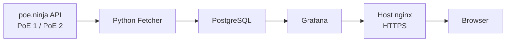

# Path of Exile Currency Tracker

A self-hosted data pipeline for collecting and visualising historical currency data from the [poe.ninja](https://poe.ninja/) API for both **Path of Exile** and **Path of Exile 2**.

The project periodically discovers the current league for each configured game, fetches the latest currency exchange data, stores each collection in PostgreSQL and displays the resulting history through Grafana.

> [**Live dashboard**](https://178.105.59.4/poe/)  
> [**Technical documentation**](https://178.105.59.4/docs/poe-tracker/)

<!-- Add a dashboard screenshot here if desired. -->
<!-- Example:  -->


## About the Project

The PoE Tracker started as a small script for collecting poe.ninja currency data and storing it for later use.

It gradually developed into a self-hosted data pipeline running alongside my Madiao project on a Linux VPS. The final version collects data for both Path of Exile and Path of Exile 2, stores historical records in PostgreSQL and provides a Grafana dashboard for exploring current and historical currency values.

The project was kept deliberately small. The main focus was not building another large application, but creating a service that could run independently on a server, recover from common failures and remain straightforward to operate.


## Architecture



The main production services are managed through Docker Compose:

| Service | Purpose |
| --- | --- |
| PostgreSQL | Stores historical currency records |
| Python fetcher | Discovers current leagues, requests poe.ninja data and writes it to PostgreSQL |
| Grafana | Queries PostgreSQL and displays the dashboard |
| pgAdmin | Optional database administration tool started only when required |

PostgreSQL is only available inside the Docker network. Grafana is bound to localhost on the VPS and exposed through the host nginx HTTPS reverse proxy. pgAdmin is also bound to localhost and is normally accessed through an SSH tunnel.


## Key Features

- Collects currency data for both Path of Exile and Path of Exile 2.
- Automatically discovers the current league for each configured game.
- Stores historical currency values in PostgreSQL.
- Configurable scheduled collection, currently set to every 60 minutes.
- Keeps PoE 1 and PoE 2 fetch failures isolated so one failed request does not prevent the other game from being processed.
- Uses request timeouts, HTTP status checking and diagnostic logging around API collection.
- Grafana selectors for game, league and currency.
- Historical currency price graph normalised to Divine Orbs.
- Current currency table showing values in Exalted Orbs, Chaos Orbs and Divine Orbs.
- Seven-day percentage change calculated against the latest available data for the selected league.
- Mirror of Kalandra value displayed relative to Divine Orbs.
- Version-controlled Grafana datasource and dashboard provisioning.
- Persistent PostgreSQL, Grafana and optional pgAdmin Docker volumes.
- PostgreSQL health checks and container restart policies.
- Optional pgAdmin administration through a Docker Compose profile.


## Dashboard

The Grafana dashboard provides three main views:

- **Currencies** - latest stored currency values in Exalted Orbs, Chaos Orbs and Divine Orbs, together with seven-day percentage change.
- **Mirror of Kalandra** - current Mirror value expressed in Divine Orbs.
- **Currency price over time** - historical value of the selected currency, normalised to Divine Orbs.

Dashboard variables follow:

```text
Game
  ↓
League
  ↓
Currency
```

This allows historical leagues to remain available after the active league changes, provided their data is still stored in PostgreSQL.


## Technology Stack

| Area | Technologies |
| --- | --- |
| Data collection | Python, Requests, Schedule |
| Database | PostgreSQL, psycopg2 |
| Visualisation | Grafana |
| Deployment | Docker, Docker Compose, Linux |
| Web access | nginx, HTTPS |
| Administration | pgAdmin, SSH |
| Configuration | Environment variables, YAML, JSON |
| Version control | Git, GitHub |


## Running the Project

### Requirements

- Docker
- Docker Compose
- Git

### 1. Clone the repository

```bash
git clone https://github.com/Gearsik/poe-tracker.git
cd poe-tracker
```

### 2. Create the environment file

Copy the supplied example:

```bash
cp .env.example .env
```

Then provide values for:

```env
DB_HOST=db
DB_PORT=5432
DB_NAME=poe_tracker_db
DB_USER=your_database_user
DB_PASSWORD=your_database_password

POE_GAMES=poe1,poe2
FETCH_INTERVAL_MINUTES=60

PGADMIN_EMAIL=your_email@example.com
PGADMIN_PASSWORD=your_pgadmin_password
```

The real `.env` file is excluded from Git.

### 3. Validate the Compose configuration

```bash
docker compose config
```

### 4. Build and start the main stack

```bash
docker compose up -d --build
```

### 5. Check the running services

```bash
docker compose ps
```

The fetcher performs an initial collection when it starts and then continues at the configured interval.

Grafana is intentionally bound to:

```text
127.0.0.1:4000
```

In the production deployment, host nginx proxies the public `/poe/` HTTPS path to that local port.


## Optional pgAdmin

pgAdmin is not part of the normal production stack.

Start the optional tools profile with:

```bash
docker compose --profile tools up -d
```

It is bound to:

```text
127.0.0.1:5050
```

and can be accessed remotely through an SSH tunnel.

The preconfigured connection is stored in `pgadmin/servers.json`. If `DB_USER` or `DB_NAME` is changed from the provided deployment values, the corresponding `Username` or `MaintenanceDB` value in that file should also be updated.


## Operational Design

The production deployment was structured to keep internal services off the public network:

- PostgreSQL has no host port.
- Grafana is bound only to localhost and exposed through nginx over HTTPS.
- pgAdmin is optional, bound only to localhost and accessed through SSH tunnelling.
- Credentials and environment-specific values are stored in `.env`, which is excluded from Git.
- PostgreSQL waits for its health check before dependent services start.
- Long-running services use Docker restart policies.
- Grafana datasource and dashboard definitions are stored in the repository so they can be recreated on a clean deployment.
- Application updates are deployed manually through Git and Docker Compose.


## Repository Structure

```text
poe-tracker/
├── grafana/
│   ├── dashboards/
│   │   └── poe-tracker dashboard.json
│   └── provisioning/
│       ├── dashboards/
│       │   └── dashboards.yaml
│       └── datasources/
│           └── postgres.yaml
│
├── pgadmin/
│   └── servers.json
│
├── main.py
├── poe_fetcher.py
├── poe_database.py
├── poe_db_config.py
├── requirements.txt
├── Dockerfile
├── compose.yaml
├── .env.example
└── README.md
```


## Documentation

The detailed operational documentation is maintained together with the Madiao documentation site:

> [**PoE Tracker Documentation**](https://178.105.59.4/docs/poe-tracker/)

It covers:

- normal Docker Compose operations
- production updates
- logs and health checks
- manual data collection
- PostgreSQL checks
- optional pgAdmin access
- Grafana provisioning
- stale-image recovery
- schema problems
- parser failures
- environment-variable problems
- clean redeployment and destructive recovery procedures

The README is intended as the project overview. The documentation site contains the more detailed operational procedures.


## Technical Areas Demonstrated

This project includes practical work with:

- Linux server deployment and service operation
- Docker images, Compose services, profiles, volumes, health checks and restart policies
- Python API integration, JSON parsing, scheduling and error handling
- PostgreSQL schema design, SQL querying and parameterised inserts
- Grafana PostgreSQL datasources, SQL-backed dashboard variables and dashboard provisioning
- nginx reverse proxying and HTTPS
- SSH tunnelling for private administration services
- environment-based configuration and credential separation
- Git-based manual deployment
- troubleshooting and operational documentation


## Data Source

Currency and league information is collected from the public [poe.ninja API](https://poe.ninja/).

The fetcher requests the active league separately for each configured game and then retrieves the corresponding currency exchange overview. No API key is stored by the project.


## Current Limitations

The project was intentionally kept small and currently has several limitations:

- Deployment is manual rather than CI/CD driven.
- Database schema changes do not use a migration system.
- Historical data depends on the local PostgreSQL volume and is not recreated automatically if that volume is removed.
- The dashboard is intended for personal portfolio use rather than as a public production service for large numbers of users.


## Project Status

The PoE Tracker is feature-complete for its original portfolio scope.

The data collection pipeline, PostgreSQL storage, Grafana dashboard, Docker deployment and operational documentation are complete. Future changes would mainly concern scaling, automated deployment or database lifecycle improvements rather than expanding the core project.
